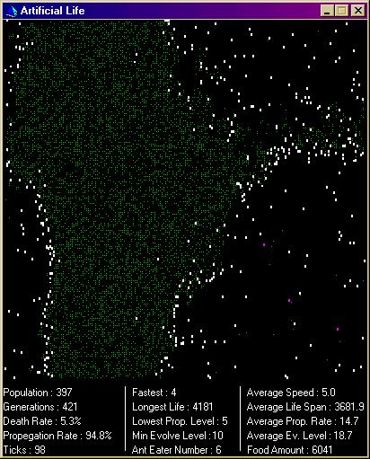



## Imitate Life v2\.0

### Description

This program demonstrats evolution of a 'species'. To clarify, I am not saying evolution is the correct solution, just that this program is based on the theory. The green dots are basic food. The white dots are the basic organisim (ants). The purple dots are ant eaters. The ants can turn to ant eaters and back again depening on the circumstances.

Please, any feedback is very welcome. Thanks to Pei Pei giving feedback and help and suggestions, this update was possible. Votes are also appreciated :) Any queries email me. Thank you
 
### More Info
 

             |
---                |---
**Submitted On**   |2001-12-03 12:13:56
**By**             |[Eric O'Sullivan](https://github.com/Planet-Source-Code/PSCIndex/blob/master/ByAuthor/eric-o-sullivan.md)
**Level**          |Advanced
**User Rating**    |4.5 (27 globes from 6 users)
**Compatibility**  |VB 5\.0, VB 6\.0
**Category**       |[Math/ Dates](https://github.com/Planet-Source-Code/PSCIndex/blob/master/ByCategory/math-dates__1-37.md)
**World**          |[Visual Basic](https://github.com/Planet-Source-Code/PSCIndex/blob/master/ByWorld/visual-basic.md)
**Archive File**   |[Imitate\_Li402011272001\.zip](https://github.com/Planet-Source-Code/eric-o-sullivan-imitate-life-v2-0__1-29573/archive/master.zip)

